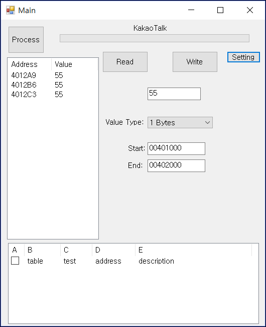

# Memory Editor

The goal is to implement the Cheat Engine via C#

To start the program, run Main.exe.

- Require : .Net Framework 4.5

- Tested On: Windows 10 x64

- Driver: Driver Test Signing

[Change Log Link](https://github.com/Empier/MemoryEditor/blob/master/ChangeLog.txt)

######################################

## Build

### Tools

Use Visual Studio 2015 Pro

Windows Driver Kit

AcroEdit

### ScreenShot

